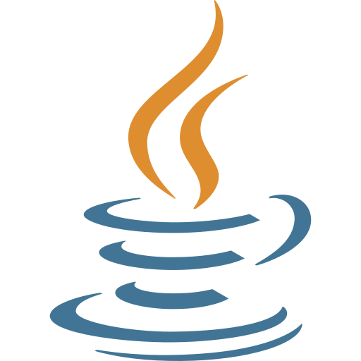

## Hey there, I'm !

 **Student**  
 **Full-Stack Developer**  
 **Veteran**   
When I'm not working on course projects, you'll most likely find me tinkering on personal projects or playing guitar while my dog sleeps nearby.

### Languages and Tools:

<!--
**TylerWStroud/TylerWStroud** is a ✨ _special_ ✨ repository because its `README.md` (this file) appears on your GitHub profile.

Here are some ideas to get you started:

- 🔭 I’m currently working on ...
- 🌱 I’m currently learning ...
- 👯 I’m looking to collaborate on ...
- 🤔 I’m looking for help with ...
- 💬 Ask me about ...
- 📫 How to reach me: ...
- 😄 Pronouns: ...
- ⚡ Fun fact: ...
  -->
